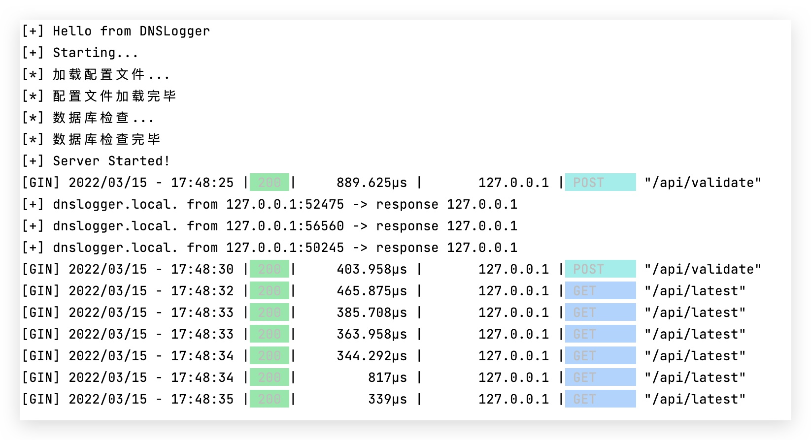

# DNSLogger

自建DNSLog平台。



### 编译 & 运行

```
export GOPROXY=https://proxy.golang.com.cn,direct # 可选
go build
./dnslogger

因采用了go-sqlite3组件，涉及到CGO，编译有问题请参考 https://github.com/mattn/go-sqlite3
```

### 配置

```
准备一个域名，假设为dnslogger.local
准备一个公网服务器，IP假设为1.1.1.1
采用*.log.dnslogger.local为DNSLog域名
第一步，添加NS记录 log -> ns.dnslogger.local.
第二步，添加A记录 ns -> 1.1.1.1
第三步，运行dnslogger
```

### 测试

```
# 发送DNS请求
dig dnslogger.local @127.0.0.1

# 查询最新的5条DNS请求
curl http://localhost:1965/api/latest -v

# 查询domain为dnslogger.local的请求（5分钟内）
curl http://localhost:1965/api/validate -d '{"domain":"dnslogger.local"}' -v
```

### 说明 & API

UDP 53 DNS

TCP 1965 API

API：

```
查看最新5条记录
GET /api/latest

根据域名查询
POST /api/validate

{"domain":"dnslogger.local"}
```

### 常见问题

```
1. Ubuntu UDP 53端口被占用
需要禁用系统自带的DNS解析服务
systemctl stop systemd-resolved.service
systemctl disable systemd-resolved.service
echo "nameserver 223.5.5.5" > /etc/resolv.conf
```

### 在Docker中运行

```
CGO_ENABLED=1 GOOS=linux go build &&
docker-compose up -d
```
