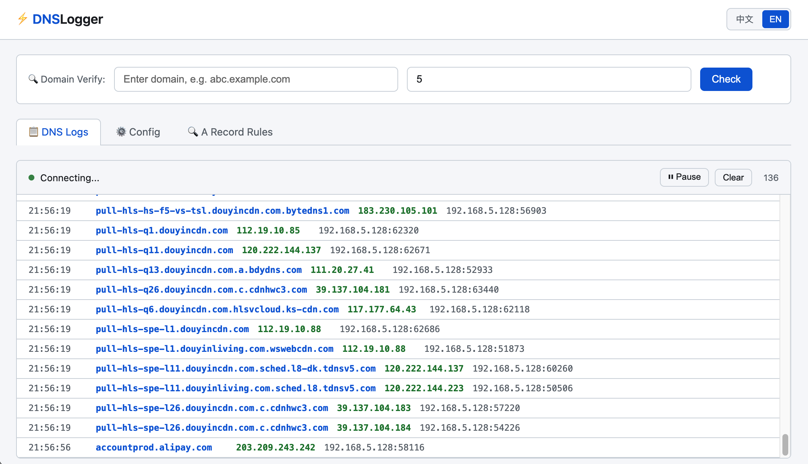

# DNSLogger

A self-hosted DNSLog platform for security testing. Captures DNS callbacks with a web dashboard, real-time streaming, and filter rules.



## Features

- DNS request logging with A record responses
- Web dashboard with real-time WebSocket log streaming
- Filter rules (exact, wildcard, regex, contains) for allow/block
- Configurable upstream DNS forwarding
- SQLite storage, no external dependencies
- Simple mode for quick domain interception

## Quick Start

### Build & Run (Full Mode)

```bash
go build
./dnslogger
```

### Simple Mode

For quick domain interception without the database/web UI:

```bash
./dnslogger simple -addr :53 -ip 12.12.12.12
```

### Docker

```bash
docker-compose up -d
```

## Configuration

On first run, a default config is loaded. Manage via API or edit the database directly.

```ini
[config]
db_file = dnslog.db
return_ip = 127.0.0.1
upstream_dns = 8.8.8.8
listen_dns = 0.0.0.0:53
listen_http = 0.0.0.0:2020
domain = log.example.com
```

## Domain Setup

| Type | Host | Value |
|------|------|-------|
| NS | `log` | `ns.yourdomain.com.` |
| A | `ns` | `your-server-ip` |

## API

| Method | Endpoint | Description |
|--------|----------|-------------|
| GET | `/api/logs` | Query logs (supports `domain`, `limit`, `offset`) |
| GET | `/api/logs/count` | Get log count |
| POST | `/api/validate` | Check if domain received a query (last N minutes) |
| DELETE | `/api/logs` | Clear all logs |
| GET | `/api/config` | Get config |
| PUT | `/api/config` | Update config |
| GET | `/api/filters` | List filter rules |
| POST | `/api/filters` | Create filter rule |
| PUT | `/api/filters/:id` | Update filter rule |
| DELETE | `/api/filters/:id` | Delete filter rule |
| GET | `/ws/logs` | WebSocket live log stream |

## Usage Example

```bash
# Send DNS query
dig test.log.example.com @your-server-ip

# Query logs
curl http://localhost:2020/api/logs

# Validate domain (default 5 min window)
curl -X POST http://localhost:2020/api/validate \
  -H "Content-Type: application/json" \
  -d '{"domain":"test.log.example.com"}'
```

## License

[MIT](LICENSE)
