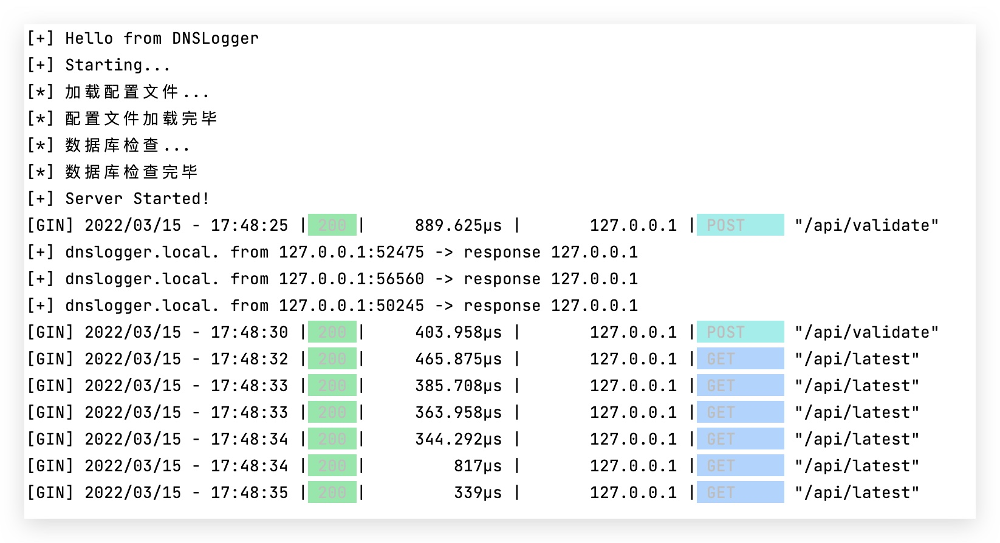

# DNSLogger

自建 DNSLog 平台，用于安全测试中检测 DNS 请求回连。支持 DNS 查询记录、HTTP API 查询，开箱即用。



## 功能特性

- DNS 请求监听与记录（A 记录）
- HTTP API 查询接口（Gin 框架）
- SQLite 本地存储，无需额外数据库依赖
- 支持 Docker 一键部署
- 优雅关闭，自动资源回收

## 快速开始

### 编译运行

```bash
# 可选：设置国内 Go 代理
export GOPROXY=https://proxy.golang.com.cn,direct

go build
./dnslogger
```

> 因使用了 go-sqlite3（CGO），编译遇问题请参考 [go-sqlite3 文档](https://github.com/mattn/go-sqlite3)。

### Docker 部署

```bash
# 先编译好二进制文件，然后：
docker-compose up -d
```

## 域名配置

假设你的域名为 `dnslogger.local`，服务器 IP 为 `1.1.1.1`，接收子域为 `*.log.dnslogger.local`：

| 步骤 | 记录类型 | 主机记录 | 记录值 |
|------|---------|---------|--------|
| 1 | NS | `log` | `ns.dnslogger.local.` |
| 2 | A | `ns` | `1.1.1.1` |

配置完成后，在服务器上启动 DNSLogger 即可。

## 配置说明

首次运行会自动从 `config.default.ini` 生成 `config.ini`：

```ini
[config]
db_file = dnslog.db          # SQLite 数据库文件路径
return_ip = 127.0.0.1        # DNS 响应返回的 IP 地址
listen_dns = 0.0.0.0:53      # DNS 监听地址
listen_http = 0.0.0.0:2020   # HTTP API 监听地址
domain = log.dnslogger.local # 接收 DNS 请求的子域
```

## API 文档

### 查询最新记录

```
GET /api/latest
```

返回最近 10 条 DNS 请求记录。

**响应示例：**

```json
{
  "data": [
    {
      "Id": 1,
      "Domain": "test.log.dnslogger.local.",
      "Type": "A",
      "Resp": "1.1.1.1",
      "Src": "192.168.1.100:12345",
      "Created": "2026-05-10T12:00:00Z"
    }
  ]
}
```

### 验证域名请求

```
POST /api/validate
Content-Type: application/json

{"domain": "test.log.dnslogger.local"}
```

查询最近 5 分钟内是否有指定域名的 DNS 请求，常用于漏洞验证场景。

**响应：** 存在记录返回 200 + 记录详情，无记录返回 204。

## 测试

```bash
# 发送 DNS 请求
dig test.log.dnslogger.local @1.1.1.1

# 查询最新记录
curl http://localhost:2020/api/latest

# 验证域名请求（5分钟内）
curl -X POST http://localhost:2020/api/validate \
  -H "Content-Type: application/json" \
  -d '{"domain":"test.log.dnslogger.local"}'
```

## 常见问题

### Ubuntu 无法监听 UDP 53 端口

Ubuntu 默认的 `systemd-resolved` 服务占用了 53 端口，需要先关闭：

```bash
sudo systemctl stop systemd-resolved
sudo systemctl disable systemd-resolved
echo "nameserver 223.5.5.5" | sudo tee /etc/resolv.conf
```

### 非 root 用户无法监听 53 端口

53 是特权端口，建议使用 `sudo` 运行，或通过 Docker 部署规避权限问题。

## License

[MIT](LICENSE)
